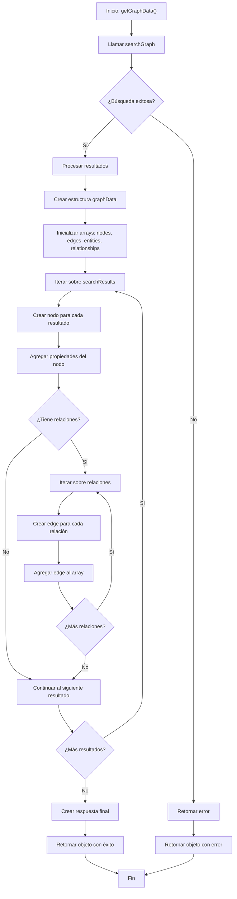
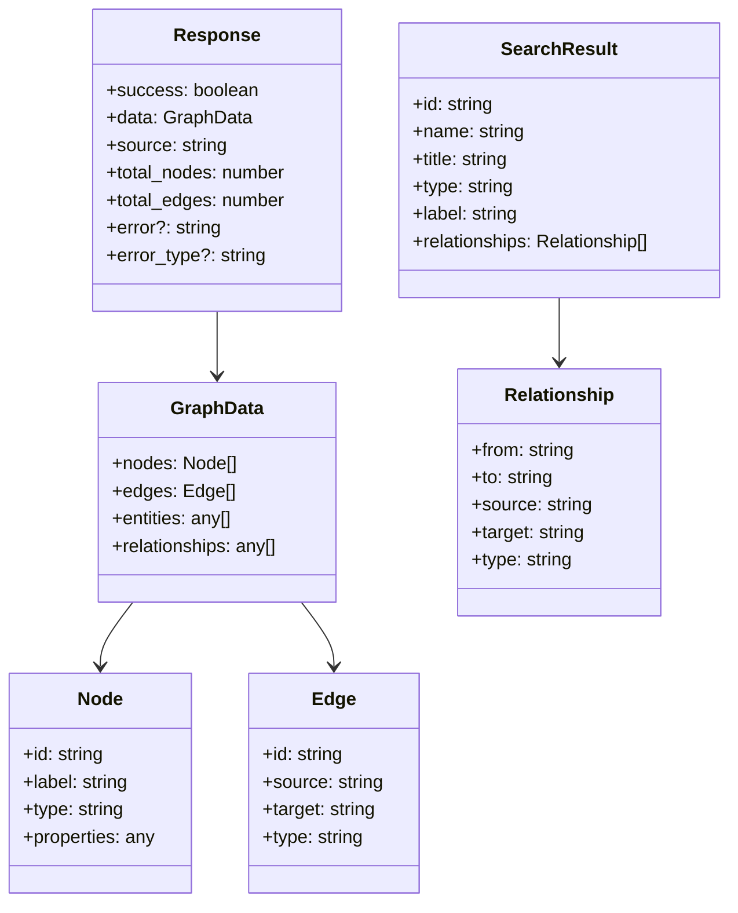
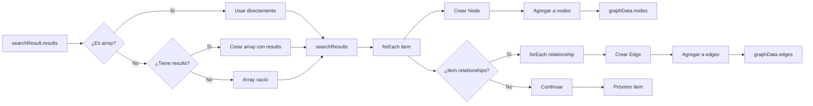
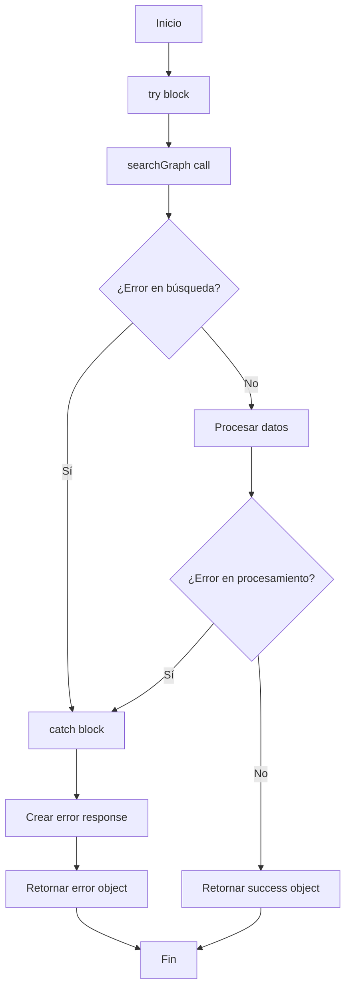
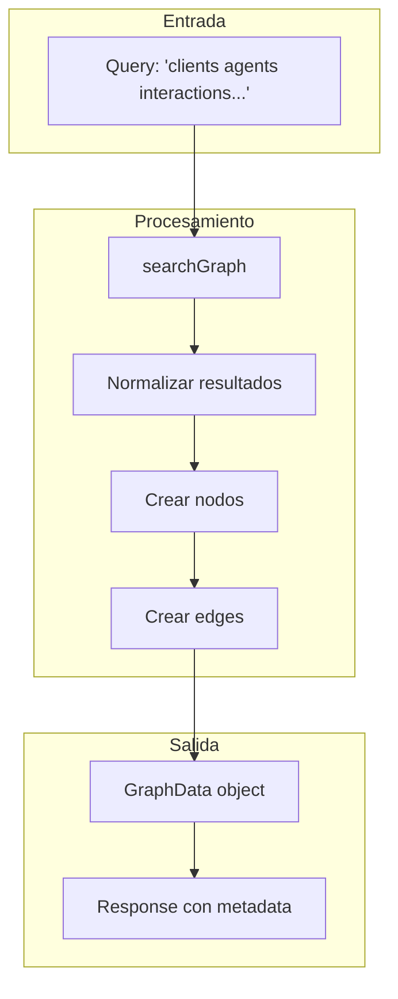

# Diagrama de Flujo - getGraphData()

## 1. Flujo Principal

```mermaid
flowchart TD
    A["Inicio: getGraphData()"] --> B["Llamar searchGraph"]
    B --> C{"¿Búsqueda exitosa?"}
    
    C -->|Sí| D["Procesar resultados"]
    C -->|No| E["Retornar error"]
    
    D --> F["Crear estructura graphData"]
    F --> G["Inicializar arrays: nodes, edges, entities, relationships"]
    
    G --> H["Iterar sobre searchResults"]
    H --> I["Crear nodo para cada resultado"]
    I --> J["Agregar propiedades del nodo"]
    
    J --> K{"¿Tiene relaciones?"}
    K -->|Sí| L["Iterar sobre relaciones"]
    K -->|No| M["Continuar al siguiente resultado"]
    
    L --> N["Crear edge para cada relación"]
    N --> O["Agregar edge al array"]
    O --> P{"¿Más relaciones?"}
    P -->|Sí| L
    P -->|No| M
    
    M --> Q{"¿Más resultados?"}
    Q -->|Sí| H
    Q -->|No| R["Crear respuesta final"]
    
    R --> S["Retornar objeto con éxito"]
    E --> T["Retornar objeto con error"]
    
    S --> U["Fin"]
    T --> U
```

## 2. Estructura de Datos

```mermaid
classDiagram
    class GraphData {
        +nodes: Node[]
        +edges: Edge[]
        +entities: any[]
        +relationships: any[]
    }
    
    class Node {
        +id: string
        +label: string
        +type: string
        +properties: any
    }
    
    class Edge {
        +id: string
        +source: string
        +target: string
        +type: string
    }
    
    class SearchResult {
        +id: string
        +name: string
        +title: string
        +type: string
        +label: string
        +relationships: Relationship[]
    }
    
    class Relationship {
        +from: string
        +to: string
        +source: string
        +target: string
        +type: string
    }
    
    class Response {
        +success: boolean
        +data: GraphData
        +source: string
        +total_nodes: number
        +total_edges: number
        +error?: string
        +error_type?: string
    }
    
    GraphData --> Node
    GraphData --> Edge
    SearchResult --> Relationship
    Response --> GraphData
```

## 3. Transformación de Datos

```mermaid
graph LR
    A["searchResult.results"] --> B{"¿Es array?"}
    B -->|Sí| C["Usar directamente"]
    B -->|No| D{"¿Tiene results?"}
    D -->|Sí| E["Crear array con results"]
    D -->|No| F["Array vacío"]
    
    C --> G["searchResults"]
    E --> G
    F --> G
    
    G --> H["forEach item"]
    H --> I["Crear Node"]
    I --> J["Agregar a nodes"]
    
    H --> K{"¿item.relationships?"}
    K -->|Sí| L["forEach relationship"]
    K -->|No| M["Continuar"]
    
    L --> N["Crear Edge"]
    N --> O["Agregar a edges"]
    
    J --> P["graphData.nodes"]
    O --> Q["graphData.edges"]
    M --> R["Próximo item"]
```

## 4. Manejo de Errores

```mermaid
flowchart TD
    A["Inicio"] --> B["try block"]
    B --> C["searchGraph call"]
    C --> D{"¿Error en búsqueda?"}
    
    D -->|Sí| E["catch block"]
    D -->|No| F["Procesar datos"]
    
    E --> G["Crear error response"]
    G --> H["Retornar error object"]
    
    F --> I{"¿Error en procesamiento?"}
    I -->|Sí| E
    I -->|No| J["Retornar success object"]
    
    H --> K["Fin"]
    J --> K
```

## 5. Resumen Visual del Proceso

```mermaid
graph TB
    subgraph "Entrada"
        A["Query: 'clients agents interactions...'"]
    end
    
    subgraph "Procesamiento"
        B["searchGraph"]
        C["Normalizar resultados"]
        D["Crear nodos"]
        E["Crear edges"]
    end
    
    subgraph "Salida"
        F["GraphData object"]
        G["Response con metadata"]
    end
    
    A --> B
    B --> C
    C --> D
    D --> E
    E --> F
    F --> G
```
