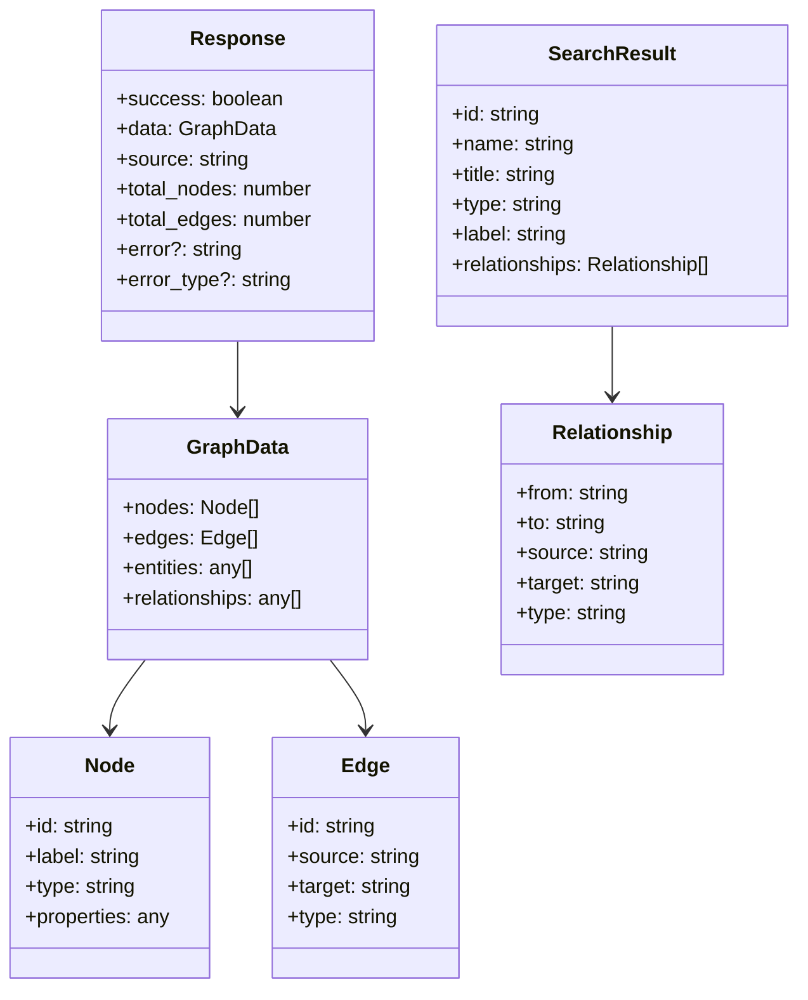
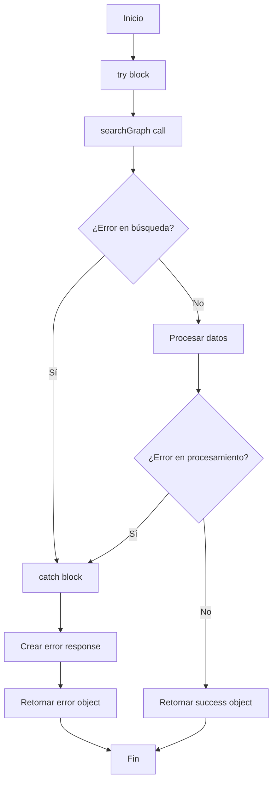

# Flujo de getGraphData() - Visualización

## Diagrama de Flujo Principal

```mermaid
flowchart TD
    A[Inicio: getGraphData()] --> B[Llamar searchGraph]
    B --> C{¿Búsqueda exitosa?}
    
    C -->|Sí| D[Procesar resultados]
    C -->|No| E[Retornar error]
    
    D --> F[Crear estructura graphData]
    F --> G[Inicializar arrays: nodes, edges, entities, relationships]
    
    G --> H[Iterar sobre searchResults]
    H --> I[Crear nodo para cada resultado]
    I --> J[Agregar propiedades del nodo]
    
    J --> K{¿Tiene relaciones?}
    K -->|Sí| L[Iterar sobre relaciones]
    K -->|No| M[Continuar al siguiente resultado]
    
    L --> N[Crear edge para cada relación]
    N --> O[Agregar edge al array]
    O --> P{¿Más relaciones?}
    P -->|Sí| L
    P -->|No| M
    
    M --> Q{¿Más resultados?}
    Q -->|Sí| H
    Q -->|No| R[Crear respuesta final]
    
    R --> S[Retornar objeto con éxito]
    E --> T[Retornar objeto con error]
    
    S --> U[Fin]
    T --> U
```

## Diagrama de Estructura de Datos



## Diagrama de Transformación de Datos

```mermaid
graph LR
    A[searchResult.results] --> B{¿Es array?}
    B -->|Sí| C[Usar directamente]
    B -->|No| D{¿Tiene results?}
    D -->|Sí| E[Crear array con results]
    D -->|No| F[Array vacío]
    
    C --> G[searchResults]
    E --> G
    F --> G
    
    G --> H[forEach item]
    H --> I[Crear Node]
    I --> J[Agregar a nodes[]]
    
    H --> K{¿item.relationships?}
    K -->|Sí| L[forEach relationship]
    K -->|No| M[Continuar]
    
    L --> N[Crear Edge]
    N --> O[Agregar a edges[]]
    
    J --> P[graphData.nodes]
    O --> Q[graphData.edges]
    M --> R[Próximo item]
```

## Diagrama de Manejo de Errores



## Resumen del Proceso

1. **Búsqueda**: Se ejecuta `searchGraph()` con una query específica
2. **Normalización**: Los resultados se convierten en un array estándar
3. **Transformación**: Cada resultado se convierte en un nodo del grafo
4. **Relaciones**: Las relaciones se extraen y convierten en edges
5. **Respuesta**: Se retorna un objeto estructurado con los datos del grafo

### Estructura de Respuesta Exitosa:
```json
{
  "success": true,
  "data": {
    "nodes": [...],
    "edges": [...],
    "entities": [...],
    "relationships": [...]
  },
  "source": "graphiti_search",
  "total_nodes": 10,
  "total_edges": 15
}
```

### Estructura de Respuesta de Error:
```json
{
  "success": false,
  "error": "Error message",
  "error_type": "graphiti_search_error",
  "data": {
    "nodes": [],
    "edges": [],
    "entities": [],
    "relationships": []
  }
}
```
